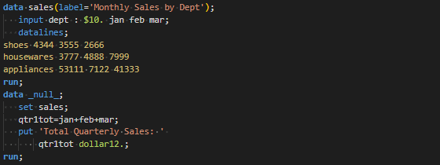
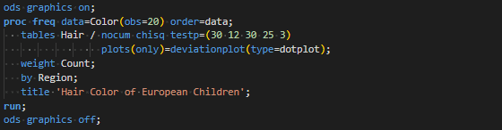
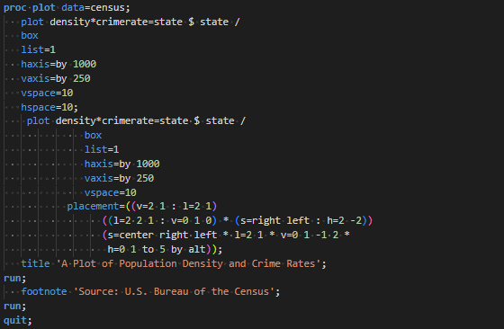

# Visual Studio Code SAS Syntax

Syntax highlighting for SAS in Visual Studio Code

## Features

### Syntax Highlighting

- Comment
- Constant and string
- Macro
- System option
- ODS statement
- Global statement
- Function
- Data step
- Data set option
- Format and informat
- SQL procedure
- Base SAS procedures: statistical procedures
- Base SAS procedures

### Theme

- Dark+ (SAS): A color theme based on Dark+ (default dark)

### Examples:

#### Data step

#### SQL procedure

#### Statistical procedure

#### Procedure

#### Macro

## Extension Settings

Syntax Highlighting
1. Click `Select Language Mode` button in the bottom-right corner
2. Search for `SAS`
3. Select `SAS (sas)`

Theme
1. File > Preferences > Color Theme
2. Select `Dark+ (SAS)`

## Known Issues

- Some SAS keywords consist of more than one word. The highlighting will not work when these keywords are split into different lines. It is a limitation of TextMate grammar.

## Bugs
Please open a new issue. However, I only update it from time to time.

## Release Notes

Read [changelog](CHANGELOG.md).

---

## Contributions

- If you are new to VS Code language extensions, you may read [Language Extensions Overview
](https://code.visualstudio.com/api/language-extensions/overview). Moreover, you may read this [TextMate manual](https://macromates.com/manual/en/language_grammars) and this [tutorial](https://www.apeth.com/nonblog/stories/textmatebundle.html) for TextMate grammar.
- If you want to play with this project, you can download it and run `npm i` in the terminal to install the required dependencies. Then, you may make some changes in `/syntaxes-yaml/sas.tmLanguage.yaml` and then press `F5` to see the effect.

## More

 - I develop this project because I need a SAS syntax highlighter to facilitate my work, but the existing SAS syntax highlighters have some bugs in my SAS code. Thus, I focus only on the syntax I need but do not exclude the possibility of implementing more syntax highlighting.
 - Not until developing the TextMate grammar for SAS did I realise it was pretty tough. The reason is SAS syntax has no simple but universal rules.
 - If you like this extension, you may [buy me a coffee](https://ko-fi.com/huits). 
 - **Enjoy!**